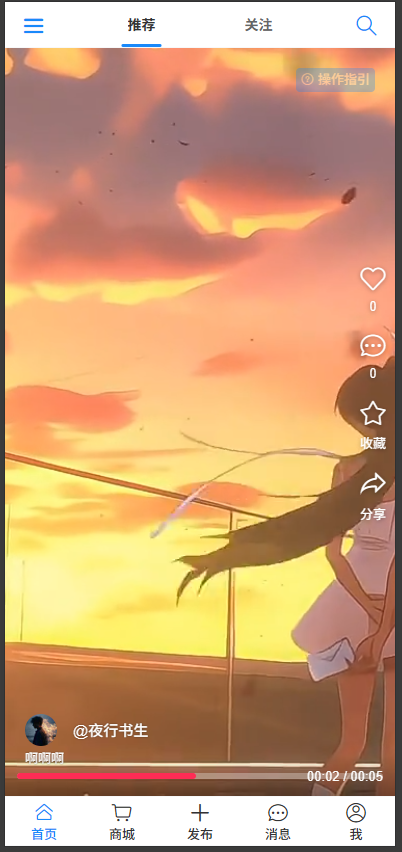

# 星屑（Stardust）

## 项目简介

星屑（Stardust）是一个以短视频为核心的社交平台。每个用户上传的短视频都被比作宇宙中的“星屑”，虽小却能汇聚成璀璨星河，传递“个体价值汇聚成光”的哲学理念。平台鼓励普通人记录生活中的微光时刻，强调情感共鸣与浪漫氛围。

## 项目截图

## 核心创意

- **星屑理念**：每个短视频都是一颗星屑，用户通过记录和分享日常，汇聚成属于大家的星河。
- **情感共鸣**：平台设有“星屑收集册”功能，用户可将视频归类为“梦想碎片”“心动时刻”等不同星系，便于整理和回忆。
- **浪漫传播**：在七夕、周年庆等特殊节点，推出“星屑许愿池”活动，用户发布视频可点亮虚拟星空，增强互动和仪式感。

## 主要功能

- 短视频上传与浏览
- 星屑收集册（视频归类与管理）
- 许愿池活动（节日互动玩法）
- 虚拟星空点亮（可视化用户贡献）

## 技术架构

- **前端**：基于 Vue3 + Vite，结构清晰，页面分为首页、用户、发布、消息、搜索、商店等模块。
- **后端**：基于 Spring Boot，分层结构（controller、service、mapper、model等），支持高效开发与维护。
- **数据库**：MySQL，配合 MyBatis 实现数据持久化。
- **部署**：支持 Docker Compose 一键部署。

## 适用场景

- 记录日常生活、梦想、心动时刻
- 节日/纪念日的浪漫互动
- 个体价值的表达与共鸣

## 项目愿景

让每个人的微光都能被看见，汇聚成属于大家的星河。
